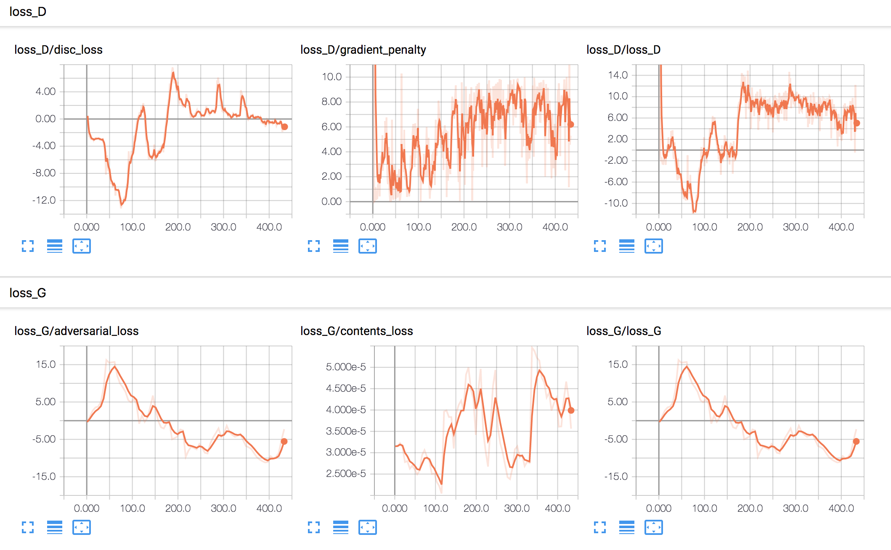
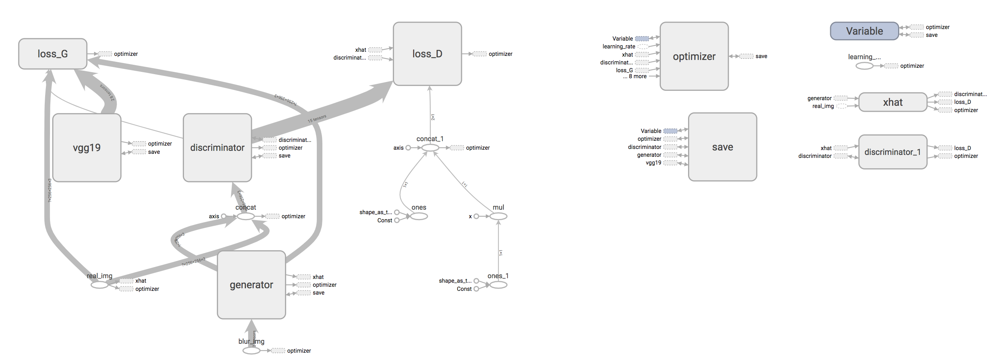
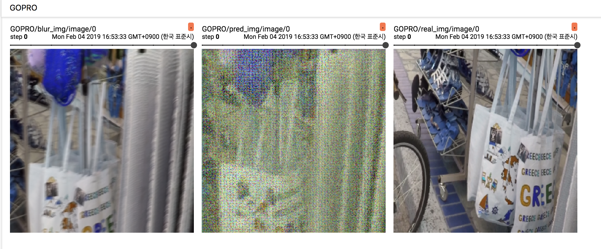

# DeblurGAN-tf
**I checked that the results are not reproduced, issue #19, and the issue is resolving**
DeblurGAN: Blind Motion Deblurring Using Conditional Adversarial Networks [paper](https://arxiv.org/abs/1711.07064)  
This repository is tensorflow (tf) implementation of DeblurGAN.

DeblurGAN removes blur filter in a image and make the image sharp, as follow:  
 

We use tensorflow 1.7.0 and opencv-python 3.4.0.12 and only support CPU version or single GPU.

## First, Download GOPRO Dataset
DeblurGAN model is trained using GOPRO dataset.  
To train the model, download the dataset from website [download](https://drive.google.com/file/d/1H0PIXvJH4c40pk7ou6nAwoxuR4Qh_Sa2/view)   

Unzip the dataset wherever you want, and remember the (data_path).  

## Model Training
You can train DeblurGAN model from the sratch, using GOPRO dataset.  
(Also, you can train if you have your own blur/sharp pair images) .   

```
python3 train.py --data_path_train (training data path) --data_path_test (test data path) 
```

There are many argument options and you can check them in `train.py` .  
When you use custom dataset, please set some arguments:  
- `--resize_or_crop` (default: resize) : resize or crop the input image to (img_h, img_w, img_c)  
- `--img_h`  (int, default: 256)  
- `--img_w`  (int, default: 256)   
- `--img_c`  (int, default: 256)  

When the model training ends, you can identify the results of Debluring GOPRO dataset.  
The results are saved in `./test_result/`  

You can also change the checkpoint and tensorboard directory using args.  
- `--checkpoint_dir` (str, default: ./checkpoints)  
- `--model_name` (str, default: DeblurGAN.model)
- `--summary_dir` (str, default: ./summaries)


## Tensorboard
During training, tensorboard is available.  
```
tensorboard --logdir=(summary path, default: './summaries') --port=(port number, default:8888)
```

#### Loss Values


#### Model Graph
 

If you want to monitor intermediate results in training process, you can see the deblur image in tensorboard with additional option.  
- `--tf_image_monitor` (bool, default: False)  




## Deblur your own Images
After training the model, you can deblur your own images using the trained model.  
First, your own images have to be in same directory and same filename extension (png, jpg, or etc...).   
```
python test.py --is_test --data_path_test (your data directory path) --img_type (image filename extension)
```

Two argumnets are important:  
- `--data_path_test` (str, default: None) : the your own data directory path have to be entered.  
- `--result_dir`(str, default: ./result_dir) : the dirtectory path where the sharp images are saved.  


## Etc 
According to the original paper, model training takes about 6 days using NVIDIA TITAN X.  
To increase training speed, i am writing tf.data modules to feed the data without bottleneck.  
Pull request and issues are always welcome.  
